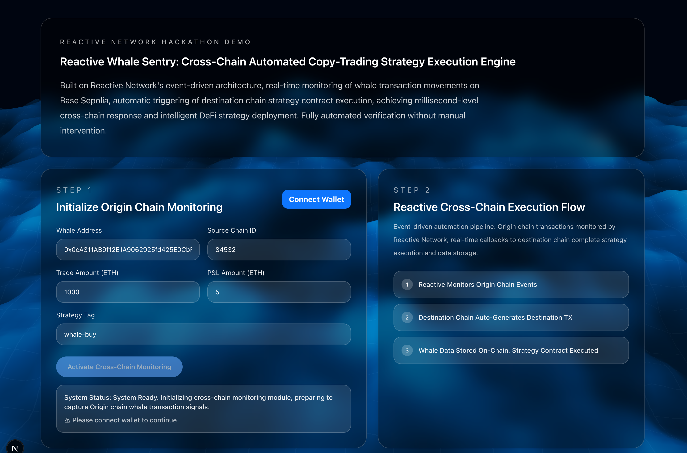

# Smart Whale Sentinel




Smart Whale Sentinel is a reactive cross-chain risk dashboard built for the Reactive Network hackathon.

It turns a whale event on the origin chain into a verifiable on-chain response on the destination chain:

1. a whale signal is emitted on the origin chain,
2. Reactive Network listens to that signal,
3. the destination chain receives the callback,
4. the system stores the whale data,
5. the strategy state is updated automatically,
6. the frontend presents the full flow as a clear demo narrative.

## What Problem We Solve

Most "smart monitoring" systems are not actually trustless.

In a common setup, a backend bot must:

- watch the source chain,
- decode events,
- decide whether action is needed,
- send a follow-up transaction on another chain.

That creates several problems:

- centralized infrastructure dependence,
- private key custody risk,
- downtime risk,
- weak auditability,
- difficulty proving that the downstream response truly came from the original on-chain trigger.

Smart Whale Sentinel replaces that fragile off-chain listener layer with a reactive contract architecture.

The result is a cleaner and more credible flow:

- the whale event itself becomes the trigger,
- Reactive Network becomes the cross-chain automation layer,
- the destination contracts persist the result on-chain,
- the frontend only needs to explain and visualize what happened.

## Why This Project Is Strong

This project is not just a dashboard. It demonstrates a complete event-driven cross-chain control loop.

### Core advantages

- **Reactive by design**: no centralized bot is required to monitor the origin event and manually relay it.
- **Verifiable execution path**: origin event, reactive callback, destination write, and strategy execution all leave a chain-level trace.
- **Clean separation of concerns**: origin, reactive, and destination responsibilities are intentionally split into distinct contracts.
- **Practical demo narrative**: the frontend explains the flow in a way that is understandable to judges, not only to developers.
- **Extensible architecture**: the same pattern can support copy trading, risk alerts, treasury automation, liquidation defense, and signal-based portfolio rebalancing.

## Project Structure

This repository is organized as a focused monorepo.

```text
Reactive-DApp-Hackathon
├── apps/web                 # Next.js frontend demo
├── packages/contracts       # Foundry contracts, deployment scripts, docs
├── packages/abi             # Shared ABIs and deployed addresses
├── packages/config          # Shared frontend chain config
└── scripts                  # Helper scripts such as address export
```

## Contract Architecture

The contract system is the heart of the project.

It is intentionally split into three layers.

### 1. Origin Layer

Purpose: emit a whale event on the source chain.

Key contract:

- `packages/contracts/src/origin/MockWhaleEmitter.sol`

Responsibilities:

- emits `WhaleTradeDetected(...)`,
- simulates whale activity for demo and testing,
- acts as the event source for Reactive Network subscriptions.

### 2. Reactive Layer

Purpose: listen to origin events and transform them into destination callbacks.

Key contract:

- `packages/contracts/src/reactive/WhaleReactiveContract.sol`

Responsibilities:

- subscribes to the origin event topic,
- validates chain and emitter source,
- decodes the event payload,
- emits a reactive callback to the destination chain.

This layer is the project's core innovation. It removes the need for a centralized relay bot.

### 3. Destination Layer

Purpose: receive the callback, persist whale data, and update the strategy state.

Key contracts:

- `packages/contracts/src/destination/WhaleCallbackReceiver.sol`
- `packages/contracts/src/destination/WhaleDataVault.sol`
- `packages/contracts/src/destination/StrategyExecutor.sol`
- `packages/contracts/src/destination/MinimalSmartAccount.sol`

Responsibilities:

- `WhaleCallbackReceiver.sol`
  receives the official callback and verifies the reactive sender.
- `WhaleDataVault.sol`
  stores whale records on-chain for later reading.
- `StrategyExecutor.sol`
  determines and records the current strategy mode.
- `MinimalSmartAccount.sol`
  provides the execution surface for the proof-style downstream transfer.

## Deployed Contracts

The following addresses are already deployed for the current demo environment.

### Base Sepolia

- Origin Emitter: `0x44014aa6ef6ed1db0893e1796a3a69796e02a3dc`
- Whale Data Vault: `0x060389c9f36a01907fe7c8c927724979c96a8a70`
- Strategy Executor: `0xe728a28466b46f23a5d062b62adefcbbdeb5b0e0`
- Whale Callback Receiver: `0x4284ae140fa663aeec04f5e83d35eb44712534ad`
- Minimal Smart Account: `0xdec89f521849a6f24fd5d9b1f8f6ccc68d2395a9`

### Reactive Network / Lasna

- Whale Reactive Contract: `0x785d29a729f85e97617c11777eae5895c4e9881e`

### Callback / System Configuration

- Destination Callback Proxy: `0xa6eA49Ed671B8a4dfCDd34E36b7a75Ac79B8A5a6`
- Reactive System Contract: `0x0000000000000000000000000000000000fffFfF`

## End-to-End Flow

This is the exact story the demo tells.

1. The frontend triggers `MockWhaleEmitter.emitMockTrade(...)` on Base Sepolia.
2. Reactive Network detects the subscribed origin event.
3. The reactive contract emits a destination callback.
4. `WhaleCallbackReceiver` receives that callback on the destination chain.
5. `WhaleDataVault` stores the whale record.
6. `StrategyExecutor` updates the strategy mode.
7. `MinimalSmartAccount` can execute the final proof-style downstream transfer.
8. The frontend presents the chain of events as a clean demo flow.

## Demo Results

The project has already been demonstrated successfully on the current deployed environment.

### Latest successful example

- Origin tx:
  `0x2599192a7008b6f12be3982c158e0af04415dd560656c4f72ec1e8199ce5c6a8`
- Destination tx:
  `0xCD64FF27A5A9F2919031F98DB0C593982A19905D41062A7C05EE5EE5D6494AB6`

### What this successful run proves

- the frontend can trigger the origin whale signal,
- Reactive Network can observe and relay that event,
- the destination chain can receive and process the callback,
- strategy execution can complete as part of the same narrative flow.

If the block explorer URL is configured in the frontend, both transactions can be opened directly from the demo page for review.

## Frontend Demo Philosophy

The frontend has been intentionally shaped for review clarity.

It focuses on a simple judge-friendly story:

- trigger the origin whale event,
- show the origin transaction,
- explain that Reactive Network relays the event,
- display a successful destination transaction,
- show the final strategy mode and outcome.

This is not meant to be a noisy operator console. It is a presentation layer for the full reactive loop.

## Documentation Map

For deeper implementation details, use the documents below.

- Contracts overview and deployment details:
  [packages/contracts/README.md](/Volumes/WD7100/ReactiveNetwork/Reactive-DApp-Hackathon/packages/contracts/README.md)
- Chinese contracts architecture and deployment guide:
  [packages/contracts/README-zh.md](/Volumes/WD7100/ReactiveNetwork/Reactive-DApp-Hackathon/packages/contracts/README-zh.md)
- Frontend demo entry:
  [apps/web/src/app/page.tsx](/Volumes/WD7100/ReactiveNetwork/Reactive-DApp-Hackathon/apps/web/src/app/page.tsx)
- Demo flow UI component:
  [apps/web/src/app/components/DemoMissionControl.tsx](/Volumes/WD7100/ReactiveNetwork/Reactive-DApp-Hackathon/apps/web/src/app/components/DemoMissionControl.tsx)
- Shared deployed addresses:
  [packages/abi/src/addresses.ts](/Volumes/WD7100/ReactiveNetwork/Reactive-DApp-Hackathon/packages/abi/src/addresses.ts)

## Why Judges Should Care

Smart Whale Sentinel is a strong hackathon project because it demonstrates something concrete and credible:

- a real on-chain event source,
- a real reactive listener layer,
- a real destination callback path,
- a real on-chain persistence layer,
- a real strategy execution layer,
- and a frontend designed to make that full story understandable.

This project shows how Reactive Network can be used for more than a toy event demo.

It illustrates a practical cross-chain automation pattern that can be adapted to:

- copy trading,
- treasury defense,
- signal-driven portfolio response,
- alert-driven execution,
- automated operational workflows between chains.

## Quick Start

### Frontend

```bash
pnpm install
pnpm dev
```

### Contracts

```bash
pnpm --dir packages/contracts build
pnpm --dir packages/contracts test
```

## Final Summary

Smart Whale Sentinel is a reactive on-chain automation system disguised as a simple whale-monitoring demo.

Its real achievement is architectural:

- the source event is on-chain,
- the relay logic is reactive,
- the destination response is on-chain,
- the strategy result is on-chain,
- the entire story is understandable in one walkthrough.

That is exactly the kind of composable, credible cross-chain automation pattern that Reactive Network is well positioned to unlock.
