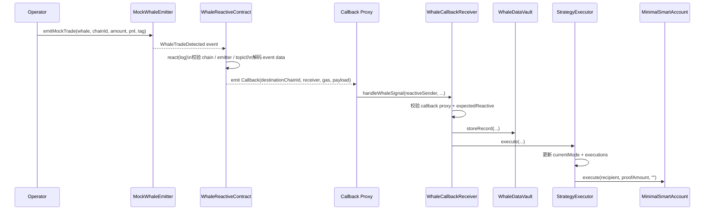
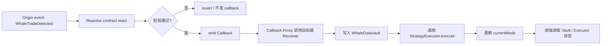

# Smart Whale Sentinel 合约说明

这份文档对应 `packages/contracts`，重点说明 `src/` 目录的整体结构、为什么采用 Reactive Network、部署顺序、当前已部署地址、模拟鲸鱼事件的方法、前端地址同步方式，以及一次完整信号从触发到落库的调用链。

## 1. 合约目的

这个项目要解决的问题很直接：

- 在源链上出现“大额鲸鱼交易信号”时，不依赖中心化机器人或后端服务。
- 由 Reactive Network 监听源链事件并触发目标链回调。
- 在目标链把信号写入链上存储，并自动切换策略状态。
- 前端只读目标链状态即可展示最新风险模式、记录数和执行历史。

一句话概括：

**源链负责发信号，Reactive 负责跨链反应，目标链负责记账和执行策略。**

## 2. 技术选型

### 为什么选择 Reactive Network

如果不用 Reactive，这套流程通常要增加一个链下服务：

1. 持续监听源链事件。
2. 解析日志。
3. 判断要不要触发策略切换。
4. 用自己的私钥去目标链发交易。

这种方案的问题是：

- 有中心化依赖。
- 服务停机就断。
- 运营者要持有私钥。
- 调度逻辑不透明，审计难度更高。

Reactive Network 的价值在于：

- 事件本身就是触发器，不需要额外 bot 常驻监听。
- 反应逻辑部署成合约，链上可验证。
- 源链事件到目标链回调之间的路由清晰固定。
- 更贴合这次 hackathon 的“事件驱动跨链响应”题目。

### 其他技术栈

- **Solidity 0.8.30**: 合约开发语言。
- **Foundry**: 编译、部署、脚本执行。
- **Base Sepolia**: 当前 demo 的源链和目标链。
- **Lasna / Reactive Network**: 反应式合约部署与订阅所在链。
- **reactive-lib**: Reactive 官方基础抽象与接口。

## 3. `src/` 整体架构

当前 `packages/contracts/src` 可以分成 4 组：

```text
src
├── origin
│   └── MockWhaleEmitter.sol
├── reactive
│   ├── ReactiveCompatBase.sol
│   ├── ReactiveTypes.sol
│   └── WhaleReactiveContract.sol
├── destination
│   ├── MinimalSmartAccount.sol
│   ├── StrategyExecutor.sol
│   ├── WhaleCallbackReceiver.sol
│   └── WhaleDataVault.sol
└── WhaleReactiveListener.sol
```

### 3.1 Origin：源链信号层

#### `src/origin/MockWhaleEmitter.sol`

职责：

- 发出 `WhaleTradeDetected(...)` 事件。
- 模拟源链鲸鱼活动。
- 作为 Reactive 订阅的事件源。

它不做复杂业务判断，只负责标准化地产生日志。

## 3.2 Reactive：跨链反应层

#### `src/reactive/WhaleReactiveContract.sol`

这是主反应式合约，职责包括：

- 记录源链 / 目标链 / emitter / receiver / topic0 等关键配置。
- 调用 `subscribe()` 向 Reactive 系统订阅源链事件。
- 在 `react()` 中校验：
  - 来源链是否正确；
  - 日志合约地址是否等于 `originEmitter`；
  - `topic_0` 是否等于 `WHALE_TOPIC0`。
- 解码日志数据，拼装目标链回调 payload。
- 通过 `Callback(...)` 事件把调用意图发给目标链回调代理。

这是整条链路里最关键的“跨链路由器”。

#### `src/reactive/ReactiveTypes.sol`

职责：

- 定义 `LogRecord` 结构体。
- 定义 `IReactive` 接口。

这类文件属于兼容 / 类型声明层，帮助描述 Reactive 日志输入格式。

#### `src/reactive/ReactiveCompatBase.sol`

职责：

- 提供兼容层事件与修饰器思路。
- 定义 `Callback` / `SubscriptionConfigured` 事件。
- 提供 `REACTIVE_IGNORE` 常量和 `owner` / `vm` 相关控制逻辑。

当前主流程里，`WhaleReactiveContract` 直接继承的是 `reactive-lib` 的抽象基类，这个文件更像本地兼容草稿和保底封装，不是当前主执行路径的核心依赖。

## 3.3 Destination：目标链状态与执行层

#### `src/destination/WhaleCallbackReceiver.sol`

职责：

- 只接受官方 callback proxy 的调用。
- 校验 `reactiveSender` 是否等于 `expectedReactive`。
- 调用 `WhaleDataVault.storeRecord(...)` 把鲸鱼信号落库。
- 调用 `StrategyExecutor.execute(...)` 更新策略状态。

它是目标链入口合约，既做权限校验，也做流程编排。

#### `src/destination/WhaleDataVault.sol`

职责：

- 保存 `WhaleRecord` 数组。
- 通过 `writers` 白名单限制谁能写入。
- 提供 `getRecord()` / `getRecordCount()` 给前端或其他合约读取。

它是目标链的数据层。

#### `src/destination/StrategyExecutor.sol`

职责：

- 维护 `currentMode`。
- 记录每次执行的 `ExecutionRecord`。
- 通过 `operators` 白名单控制谁能触发执行。
- 可选地通过 `MinimalSmartAccount` 向 proof recipient 发一笔“证明性转账”。

当前源码里的模式切换逻辑非常简单，按真实代码是：

- `amount > 0 ether` => `Hedge`
- 否则如果 `pnl < 0` => `Grid`
- 否则 => `Observe`

这意味着：

- 只要金额大于 0，当前实现就会进入 `Hedge`。
- 想走到 `Grid` 分支，必须让 `amount == 0` 且 `pnl < 0`。

这是 README 里必须说明的点，否则很容易和“鲸鱼阈值”这种更复杂预期混淆。

#### `src/destination/MinimalSmartAccount.sol`

职责：

- 提供最小执行账户。
- 允许白名单 executor 代理发起外部调用。
- 被 `StrategyExecutor` 用来执行 proof payment。

它不是主流程必需的跨链组件，但承担了“策略执行副作用”的执行面。

## 3.4 Support / Mock：本地或降级演示层

#### `src/WhaleReactiveListener.sol`

职责：

- 绕开真正的 Reactive 网络，直接调用 `vault.storeRecord(...)` 和 `executor.execute(...)`。
- 用于本地测试、无 Reactive 环境时的 demo、或排查目标链逻辑。

它不属于正式跨链流程，只是 mock listener。

## 4. 整体调用架构

主流程分为三段：

1. **源链发事件**：`MockWhaleEmitter.emitMockTrade(...)`
2. **Reactive 订阅并转发**：`WhaleReactiveContract.react(...)`
3. **目标链接收并执行**：`WhaleCallbackReceiver.handleWhaleSignal(...)`

### Mermaid 时序图



### Mermaid 流程图



## 5. 一个完整例子

### 例子 1：正常正金额事件

假设你发出：

- `amount = 1000 ether`
- `pnl = 5 ether`
- `strategyTag = "whale-buy"`

调用链如下：

1. `MockWhaleEmitter.emitMockTrade(...)` 发出 `WhaleTradeDetected`。
2. `WhaleReactiveContract.react(...)` 收到日志并发出 `Callback`。
3. callback proxy 调用 `WhaleCallbackReceiver.handleWhaleSignal(...)`。
4. `WhaleCallbackReceiver` 先写 `WhaleDataVault`，再调 `StrategyExecutor.execute(...)`。
5. `StrategyExecutor` 发现 `amount > 0 ether`，于是把 `currentMode` 更新为 `Hedge`。
6. 如果配置了 `proofRecipients[Hedge]` 和 `proofAmounts[Hedge]`，还会通过 `MinimalSmartAccount.execute(...)` 发一笔 proof transfer。
7. 前端读 `getRecordCount()`、`getRecord()`、`getExecutionCount()`、`currentMode()` 后，页面就能同步显示新状态。

### 例子 2：如何触发 `Grid`

按当前合约逻辑，想进入 `Grid`，需要：

- `amount = 0`
- `pnl < 0`

因为 `amount > 0 ether` 的判断优先级更高，只要金额大于 0，就不会进入 `Grid` 分支。

## 6. 环境变量准备

建议把变量分成 4 类：链连接、部署私钥、部署产物、前端同步。

### 6.1 最小必需变量

```bash
ORIGIN_RPC=https://base-sepolia.drpc.org
ORIGIN_CHAIN_ID=84532
ORIGIN_PRIVATE_KEY=

DESTINATION_RPC=https://base-sepolia.drpc.org
DESTINATION_CHAIN_ID=84532
DESTINATION_PRIVATE_KEY=

REACTIVE_RPC=https://lasna-rpc.rnk.dev/
REACTIVE_PRIVATE_KEY=

SYSTEM_CONTRACT_ADDR=0x0000000000000000000000000000000000fffFfF
DESTINATION_CALLBACK_PROXY_ADDR=0xa6eA49Ed671B8a4dfCDd34E36b7a75Ac79B8A5a6
DESTINATION_RECEIVER_FUND=10000000000000000
REACTIVE_DEPLOY_VALUE=50000000000000000
```

说明：

- `ORIGIN_*`：源链部署与模拟事件使用。
- `DESTINATION_*`：目标链部署、绑定 `expectedReactive` 使用。
- `REACTIVE_*`：Reactive 合约部署和 `subscribe()` 使用。
- `SYSTEM_CONTRACT_ADDR`：Reactive 系统合约地址。
- `DESTINATION_CALLBACK_PROXY_ADDR`：目标链官方 callback proxy。
- `DESTINATION_RECEIVER_FUND`：部署目标链接收器时预充 ETH，避免 callback 执行扣费失败。
- `REACTIVE_DEPLOY_VALUE`：Reactive 合约部署时带上的初始金额。

### 6.2 部署后生成的关键变量

```bash
ORIGIN_EMITTER=<origin_emitter_address>
CALLBACK_RECEIVER=<whale_callback_receiver_address>
WHALE_TOPIC0=<keccak_of_event_signature>

WHALE_DATA_VAULT=<vault_address>
STRATEGY_EXECUTOR=<executor_address>
SMART_ACCOUNT=<smart_account_address>
WHALE_REACTIVE_CONTRACT=<reactive_contract_address>
```

### 6.3 当前环境里已经部署好的公开地址

以下内容来自当前仓库 `.env` 和 `broadcast` 记录，可直接作为现有 demo 地址使用：

```bash
ORIGIN_EMITTER=0x44014aa6ef6ed1db0893e1796a3a69796e02a3dc
CALLBACK_RECEIVER=0x4284ae140fa663aeec04f5e83d35eb44712534ad
WHALE_TOPIC0=0xb4d1476b74618800fb4c8370910a2b01f2e52f1c6a75a6390f4f3e38d080a62e

WHALE_DATA_VAULT=0x060389c9f36a01907fe7c8c927724979c96a8a70
STRATEGY_EXECUTOR=0xe728a28466b46f23a5d062b62adefcbbdeb5b0e0
SMART_ACCOUNT=0xdec89f521849a6f24fd5d9b1f8f6ccc68d2395a9
WHALE_CALLBACK_RECEIVER=0x4284ae140fa663aeec04f5e83d35eb44712534ad
WHALE_REACTIVE_CONTRACT=0x785d29a729f85e97617c11777eae5895c4e9881e
```

私钥不要写入 README，也不要提交到仓库。

## 7. 部署顺序

部署顺序不能乱，因为 Reactive 部署依赖前两步产物地址：

1. 部署源链 emitter
2. 部署目标链 vault / executor / receiver / smart account
3. 部署 Reactive 合约
4. 调 `subscribe()`
5. 调 `setExpectedReactive(...)`
6. 同步前端地址

## 8. 逐步部署与实际输出

### 8.1 部署源链 `MockWhaleEmitter`

```bash
source .env
forge script script/DeployOrigin.s.sol:DeployOriginScript \
  --rpc-url $ORIGIN_RPC \
  --private-key $ORIGIN_PRIVATE_KEY \
  --broadcast
```

当前环境的实际输出：

```bash
MockWhaleEmitter=0x44014aa6ef6ed1db0893e1796a3a69796e02a3dc
```

这个地址来自：

- `packages/contracts/broadcast/DeployOrigin.s.sol/84532/run-latest.json`
- `.env` 中的 `ORIGIN_EMITTER`

### 8.2 部署目标链合约组

```bash
source .env
forge script script/DeployDestination.s.sol:DeployDestinationScript \
  --rpc-url $DESTINATION_RPC \
  --private-key $DESTINATION_PRIVATE_KEY \
  --broadcast
```

这个脚本一次会做两类事情：

- 部署 4 个合约：
  - `WhaleDataVault`
  - `StrategyExecutor`
  - `WhaleCallbackReceiver`
  - `MinimalSmartAccount`
- 完成 6 类初始化配置：
  - `vault.setWriter(receiver, true)`
  - `executor.setOperator(receiver, true)`
  - `executor.setSmartAccount(account)`
  - `account.setExecutor(executor, true)`
  - `executor.setProofRecipient(...)`
  - `executor.setProofAmount(...)`

当前环境的实际输出：

```bash
WHALE_DATA_VAULT=0x060389c9f36a01907fe7c8c927724979c96a8a70
STRATEGY_EXECUTOR=0xe728a28466b46f23a5d062b62adefcbbdeb5b0e0
WHALE_CALLBACK_RECEIVER=0x4284ae140fa663aeec04f5e83d35eb44712534ad
SMART_ACCOUNT=0xdec89f521849a6f24fd5d9b1f8f6ccc68d2395a9
```

对应初始化调用也已经执行过：

```bash
setWriter(receiver, true)
setOperator(receiver, true)
setSmartAccount(account)
setExecutor(executor, true)
setProofRecipient(Observe/Hedge/Grid/Paused, 0x0cA311AB9f12E1A9062925fd425E0CbFB84F97aF)
setProofAmount(Hedge, 100000000000000)
setProofAmount(Grid, 100000000000000)
```

### 8.3 计算事件 topic

Reactive 订阅的事件签名是：

```solidity
WhaleTradeDetected(address,uint256,uint256,uint256,int256,bytes32)
```

计算方式：

```bash
cast keccak "WhaleTradeDetected(address,uint256,uint256,uint256,int256,bytes32)"
```

当前环境值：

```bash
WHALE_TOPIC0=0xb4d1476b74618800fb4c8370910a2b01f2e52f1c6a75a6390f4f3e38d080a62e
```

### 8.4 部署 Reactive 合约

部署前先导出依赖地址：

```bash
export ORIGIN_EMITTER=0x44014aa6ef6ed1db0893e1796a3a69796e02a3dc
export CALLBACK_RECEIVER=0x4284ae140fa663aeec04f5e83d35eb44712534ad
export WHALE_TOPIC0=0xb4d1476b74618800fb4c8370910a2b01f2e52f1c6a75a6390f4f3e38d080a62e
```

然后执行：

```bash
source .env
forge script script/DeployReactive.s.sol:DeployReactiveScript \
  --rpc-url $REACTIVE_RPC \
  --private-key $REACTIVE_PRIVATE_KEY \
  --broadcast
```

当前环境的实际输出：

```bash
WHALE_REACTIVE_CONTRACT=0x785d29a729f85e97617c11777eae5895c4e9881e
```

部署参数实际对应：

```bash
originChainId=84532
destinationChainId=84532
originEmitter=0x44014aa6ef6ed1db0893e1796a3a69796e02a3dc
callbackReceiver=0x4284ae140fa663aeec04f5e83d35eb44712534ad
whaleTopic0=0xb4d1476b74618800fb4c8370910a2b01f2e52f1c6a75a6390f4f3e38d080a62e
```

### 8.5 订阅 Reactive 事件

部署 Reactive 合约不等于已经开始监听。还必须执行：

```bash
cast send $WHALE_REACTIVE_CONTRACT "subscribe()" \
  --rpc-url $REACTIVE_RPC \
  --private-key $REACTIVE_PRIVATE_KEY
```

预期看到：

- Reactive 系统侧订阅成功
- `SubscriptionRequested` 事件

如果这一步没做，后续即使源链发事件，目标链也不会收到回调。

### 8.6 绑定目标链接收器允许的 Reactive 发送者

```bash
cast send $WHALE_CALLBACK_RECEIVER "setExpectedReactive(address)" $WHALE_REACTIVE_CONTRACT \
  --rpc-url $DESTINATION_RPC \
  --private-key $DESTINATION_PRIVATE_KEY
```

预期看到：

- `ExpectedReactiveUpdated` 事件

如果不绑定，取决于当前 `expectedReactive` 是否为零地址；正式环境建议显式绑定，避免伪造回调。

## 9. 模拟鲸鱼事件

仓库已经提供了脚本：

- `script/SimulateOriginEvent.s.sol`

使用前设置：

```bash
export ORIGIN_EMITTER=0x44014aa6ef6ed1db0893e1796a3a69796e02a3dc
export MOCK_WHALE=0x0cA311AB9f12E1A9062925fd425E0CbFB84F97aF
export MOCK_SOURCE_CHAIN_ID=84532
export MOCK_AMOUNT=1000000000000000000000
export MOCK_PNL=5000000000000000000
export MOCK_STRATEGY_TAG=0x7768616c652d6275790000000000000000000000000000000000000000000000
```

执行：

```bash
forge script script/SimulateOriginEvent.s.sol:SimulateOriginEventScript \
  --rpc-url $ORIGIN_RPC \
  --private-key $ORIGIN_PRIVATE_KEY \
  --broadcast
```

预期链路结果：

1. 源链出现 `WhaleTradeDetected`。
2. Reactive 链出现 `ReactiveLogAccepted` 和 `Callback`。
3. 目标链出现 `WhaleSignalHandled`。
4. `WhaleDataVault.getRecordCount()` 增加。
5. `StrategyExecutor.getExecutionCount()` 增加。
6. `StrategyExecutor.currentMode()` 更新为 `Hedge`。

### 如果你想演示 `Grid`

```bash
export MOCK_AMOUNT=0
export MOCK_PNL=-1000000000000000000
```

否则当前实现会优先走 `Hedge`。

## 10. 前端地址同步

前端读取的是目标链状态，关键环境变量如下：

```bash
NEXT_PUBLIC_RPC_URL=https://sepolia.base.org
NEXT_PUBLIC_CHAIN_ID=84532
NEXT_PUBLIC_WHALE_DATA_VAULT=0x060389c9f36a01907fe7c8c927724979c96a8a70
NEXT_PUBLIC_STRATEGY_EXECUTOR=0xe728a28466b46f23a5d062b62adefcbbdeb5b0e0
NEXT_PUBLIC_SMART_ACCOUNT=0xdec89f521849a6f24fd5d9b1f8f6ccc68d2395a9
NEXT_PUBLIC_WHALE_CALLBACK_RECEIVER=0x4284ae140fa663aeec04f5e83d35eb44712534ad
NEXT_PUBLIC_WHALE_REACTIVE_CONTRACT=0x785d29a729f85e97617c11777eae5895c4e9881e
NEXT_PUBLIC_ORIGIN_EMITTER=0x44014aa6ef6ed1db0893e1796a3a69796e02a3dc
```

### 两种同步方式

#### 方式 A：直接写前端环境变量

把上面的 `NEXT_PUBLIC_*` 写进前端环境文件。

#### 方式 B：同步到共享地址导出

仓库里有脚本：

- `scripts/export-deployments.ts`

它会读取 `.env` 中的 `NEXT_PUBLIC_*` 或同名部署变量，并生成：

- `packages/abi/src/addresses.ts`

当前导出的共享地址已经是：

```ts
export const deployedAddresses = {
  whaleDataVault: "0x060389c9f36a01907fe7c8c927724979c96a8a70",
  strategyExecutor: "0xe728a28466b46f23a5d062b62adefcbbdeb5b0e0",
  smartAccount: "0xdec89f521849a6f24fd5d9b1f8f6ccc68d2395a9",
  whaleCallbackReceiver: "0x4284ae140fa663aeec04f5e83d35eb44712534ad",
  whaleReactiveContract: "0x785d29a729f85e97617c11777eae5895c4e9881e",
  originEmitter: "0x44014aa6ef6ed1db0893e1796a3a69796e02a3dc"
} as const;
```

如果你希望用脚本刷新共享地址，当前建议做法是：

- 先保证 `.env` 中的部署地址和 `NEXT_PUBLIC_*` 已更新。
- 再用你本地可用的 TypeScript 运行方式执行 `scripts/export-deployments.ts`，或直接手动更新 `packages/abi/src/addresses.ts`。

这个脚本本身逻辑很简单，只是把环境变量整理后写入共享地址导出文件。

## 11. 前端到底读了什么

前端页面核心读取逻辑在 `apps/web/src/app/page.tsx`，主要读取：

- `WhaleDataVault.getRecordCount()`
- `WhaleDataVault.getRecord(index)`
- `StrategyExecutor.getExecutionCount()`
- `StrategyExecutor.currentMode()`

因此前端地址同步失败时，最直接的表现是：

- 页面显示 `UNDEPLOYED`
- 页面显示 `RPC ERROR`
- 记录数和执行数一直是 0

## 12. 常见错误与问题总结

### 12.1 源链有事件，目标链没有记录

通常排查顺序如下：

1. Reactive 合约是否真的执行过 `subscribe()`。
2. `WhaleReactiveContract` 的 `originEmitter` 是否和源链 emitter 地址一致。
3. `WHALE_TOPIC0` 是否正确。
4. `WhaleCallbackReceiver.expectedReactive` 是否已设置成正确的 Reactive 合约地址。
5. `DESTINATION_CALLBACK_PROXY_ADDR` 是否为目标链官方 proxy。
6. Reactive 链上是否有 debt 未覆盖。

检查 debt：

```bash
cast call $SYSTEM_CONTRACT_ADDR "debt(address)" $WHALE_REACTIVE_CONTRACT --rpc-url $REACTIVE_RPC
```

需要时补缴：

```bash
cast send $WHALE_REACTIVE_CONTRACT "coverDebt()" \
  --rpc-url $REACTIVE_RPC \
  --private-key $REACTIVE_PRIVATE_KEY
```

### 12.2 目标链报 `PaymentFailure` / `CallbackFailure`

原因通常是 `WhaleCallbackReceiver` 没钱，callback proxy 扣费失败。

当前部署脚本已经支持：

```bash
DESTINATION_RECEIVER_FUND=10000000000000000
```

也就是部署时给 receiver 充值 `0.01 ETH`。如果你重新部署，请保留这个值或更高。

### 12.3 `unexpected reactive sender`

这是 `WhaleCallbackReceiver` 的保护逻辑在生效，说明：

- `expectedReactive` 配置错了；或
- 你换了一个新的 Reactive 合约，但没有重新绑定。

修复方式：

```bash
cast send $WHALE_CALLBACK_RECEIVER "setExpectedReactive(address)" $WHALE_REACTIVE_CONTRACT \
  --rpc-url $DESTINATION_RPC \
  --private-key $DESTINATION_PRIVATE_KEY
```

### 12.4 `authorized sender only`

这说明目标链调用者不是官方 callback proxy，或 `DESTINATION_CALLBACK_PROXY_ADDR` 配置错了。

`WhaleCallbackReceiver` 继承了 `AbstractCallback`，入口权限不是任意地址都能绕过的。

### 12.5 模拟事件发出后模式不符合预期

这是最容易误判的一点。

当前 `StrategyExecutor.execute(...)` 的真实逻辑是：

```solidity
if (amount > 0 ether) {
    currentMode = Mode.Hedge;
} else if (pnl < 0) {
    currentMode = Mode.Grid;
} else {
    currentMode = Mode.Observe;
}
```

所以：

- `amount > 0` 时不会进入 `Grid`
- 想测试 `Grid` 必须令 `amount == 0`

### 12.6 前端页面还在读旧地址

检查：

1. `.env` 中的 `NEXT_PUBLIC_*` 是否已更新。
2. `packages/abi/src/addresses.ts` 是否已经重新导出。
3. 前端是否重新启动。

### 12.7 `.env` 格式不规范

当前仓库 `.env` 中有少数键前面带空格。某些工具会自动容忍，但不建议依赖这种行为。

建议统一写成：

```bash
CALLBACK_RECEIVER=0x...
NEXT_PUBLIC_WHALE_DATA_VAULT=0x...
```

不要在键名前留空格，也不要把私钥提交到版本库。

## 13. 相关文件清单

### 合约

- `src/origin/MockWhaleEmitter.sol`
- `src/reactive/WhaleReactiveContract.sol`
- `src/reactive/ReactiveTypes.sol`
- `src/reactive/ReactiveCompatBase.sol`
- `src/destination/WhaleCallbackReceiver.sol`
- `src/destination/WhaleDataVault.sol`
- `src/destination/StrategyExecutor.sol`
- `src/destination/MinimalSmartAccount.sol`
- `src/WhaleReactiveListener.sol`

### 部署 / 模拟脚本

- `script/DeployOrigin.s.sol`
- `script/DeployDestination.s.sol`
- `script/DeployReactive.s.sol`
- `script/SimulateOriginEvent.s.sol`

### 前端地址与共享导出

- `scripts/export-deployments.ts`
- `packages/abi/src/addresses.ts`
- `apps/web/src/app/page.tsx`
