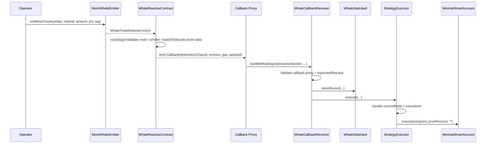
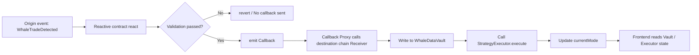

# Smart Whale Sentinel Contract Documentation

This document corresponds to `packages/contracts`, focusing on the overall structure of the `src/` directory, why Reactive Network was chosen, deployment order, currently deployed addresses, methods for simulating whale events, frontend address synchronization, and the complete call chain from signal trigger to data storage.

## 1. Contract Purpose

The problem this project solves is straightforward:

- When a "large whale trading signal" appears on the source chain, no reliance on centralized bots or backend services is needed.
- Reactive Network listens to source chain events and triggers destination chain callbacks.
- Signals are written to on-chain storage on the destination chain, and strategy states are automatically switched.
- The frontend only needs to read the destination chain state to display the latest risk patterns, record counts, and execution history.

In one sentence:

**Source chain sends signals, Reactive handles cross-chain reactions, destination chain handles accounting and strategy execution.**

## 2. Technology Choices

### Why Choose Reactive Network

Without Reactive, this process would typically require an additional off-chain service:

1. Continuously monitor source chain events.
2. Parse logs.
3. Determine whether to trigger strategy switching.
4. Use your own private key to send transactions on the destination chain.

Problems with this approach:

- Has centralized dependencies.
- Service downtime causes interruptions.
- Operators must hold private keys.
- Scheduling logic is not transparent, making audits more difficult.

The value of Reactive Network:

- Events themselves are triggers; no need for additional bots to listen continuously.
- Reaction logic is deployed as contracts, verifiable on-chain.
- Routing from source chain events to destination chain callbacks is clear and fixed.
- Better fits the hackathon's "event-driven cross-chain response" theme.

### Other Technology Stack

- **Solidity 0.8.30**: Contract development language.
- **Foundry**: Compilation, deployment, and script execution.
- **Base Sepolia**: Current demo source and destination chain.
- **Lasna / Reactive Network**: Reactive contract deployment and subscription chain.
- **reactive-lib**: Reactive official base abstractions and interfaces.

## 3. `src/` Overall Architecture

Current `packages/contracts/src` can be divided into 4 groups:

```text
src
├── origin
│   └── MockWhaleEmitter.sol
├── reactive
│   ├── ReactiveCompatBase.sol
│   ├── ReactiveTypes.sol
│   └── WhaleReactiveContract.sol
├── destination
│   ├── MinimalSmartAccount.sol
│   ├── StrategyExecutor.sol
│   ├── WhaleCallbackReceiver.sol
│   └── WhaleDataVault.sol
└── WhaleReactiveListener.sol
```

### 3.1 Origin: Source Chain Signal Layer

#### `src/origin/MockWhaleEmitter.sol`

Responsibilities:

- Emit `WhaleTradeDetected(...)` events.
- Simulate source chain whale activity.
- Serve as the event source for Reactive subscriptions.

It doesn't make complex business judgments; it only standardizes log generation.

## 3.2 Reactive: Cross-Chain Reaction Layer

#### `src/reactive/WhaleReactiveContract.sol`

This is the main reactive contract. Responsibilities include:

- Recording key configurations like source chain / destination chain / emitter / receiver / topic0.
- Calling `subscribe()` to subscribe to source chain events with the Reactive system.
- In `react()`, validate:
  - Whether the source chain is correct;
  - Whether the log contract address equals `originEmitter`;
  - Whether `topic_0` equals `WHALE_TOPIC0`.
- Decode log data and assemble the destination chain callback payload.
- Send the call intent to the destination chain callback proxy via the `Callback(...)` event.

This is the most critical "cross-chain router" in the entire flow.

#### `src/reactive/ReactiveTypes.sol`

Responsibilities:

- Define the `LogRecord` struct.
- Define the `IReactive` interface.

These files belong to the compatibility / type declaration layer, helping describe the Reactive log input format.

#### `src/reactive/ReactiveCompatBase.sol`

Responsibilities:

- Provide compatibility layer events and modifier ideas.
- Define `Callback` / `SubscriptionConfigured` events.
- Provide `REACTIVE_IGNORE` constant and `owner` / `vm` related control logic.

In the current main flow, `WhaleReactiveContract` directly inherits from the `reactive-lib` abstract base class. This file is more like a local compatibility draft and fallback encapsulation, not a core dependency of the current main execution path.

## 3.3 Destination: Destination Chain State and Execution Layer

#### `src/destination/WhaleCallbackReceiver.sol`

Responsibilities:

- Only accept calls from the official callback proxy.
- Validate that `reactiveSender` equals `expectedReactive`.
- Call `WhaleDataVault.storeRecord(...)` to store the whale signal.
- Call `StrategyExecutor.execute(...)` to update the strategy state.

It is the destination chain entry contract, handling both permission validation and flow orchestration.

#### `src/destination/WhaleDataVault.sol`

Responsibilities:

- Store the `WhaleRecord` array.
- Restrict who can write via the `writers` whitelist.
- Provide `getRecord()` / `getRecordCount()` for the frontend or other contracts to read.

It is the data layer of the destination chain.

#### `src/destination/StrategyExecutor.sol`

Responsibilities:

- Maintain `currentMode`.
- Record each execution's `ExecutionRecord`.
- Control who can trigger execution via the `operators` whitelist.
- Optionally send a "proof transfer" to the proof recipient via `MinimalSmartAccount`.

The current mode switching logic in the source code is very simple. According to the actual code:

- `amount > 0 ether` => `Hedge`
- Else if `pnl < 0` => `Grid`
- Else => `Observe`

This means:

- As long as the amount is greater than 0, the current implementation will enter `Hedge`.
- To reach the `Grid` branch, you must have `amount == 0` and `pnl < 0`.

This is a point that must be explained in the README, otherwise it's easy to confuse with more complex expectations like "whale thresholds".

#### `src/destination/MinimalSmartAccount.sol`

Responsibilities:

- Provide a minimal execution account.
- Allow whitelisted executors to proxy external calls.
- Used by `StrategyExecutor` to execute proof payments.

It is not a required cross-chain component for the main flow, but it handles the "strategy execution side effects" execution surface.

## 3.4 Support / Mock: Local or Fallback Demo Layer

#### `src/WhaleReactiveListener.sol`

Responsibilities:

- Bypass the real Reactive network and directly call `vault.storeRecord(...)` and `executor.execute(...)`.
- Used for local testing, demos without a Reactive environment, or troubleshooting destination chain logic.

It does not belong to the formal cross-chain flow; it's just a mock listener.

## 4. Overall Call Architecture

The main flow is divided into three stages:

1. **Source chain emits event**: `MockWhaleEmitter.emitMockTrade(...)`
2. **Reactive subscribes and forwards**: `WhaleReactiveContract.react(...)`
3. **Destination chain receives and executes**: `WhaleCallbackReceiver.handleWhaleSignal(...)`

### Mermaid Sequence Diagram



### Mermaid Flowchart



## 5. A Complete Example

### Example 1: Normal Positive Amount Event

Assume you emit:

- `amount = 1000 ether`
- `pnl = 5 ether`
- `strategyTag = "whale-buy"`

The call chain is as follows:

1. `MockWhaleEmitter.emitMockTrade(...)` emits `WhaleTradeDetected`.
2. `WhaleReactiveContract.react(...)` receives the log and emits `Callback`.
3. Callback proxy calls `WhaleCallbackReceiver.handleWhaleSignal(...)`.
4. `WhaleCallbackReceiver` first writes to `WhaleDataVault`, then calls `StrategyExecutor.execute(...)`.
5. `StrategyExecutor` detects `amount > 0 ether`, so it updates `currentMode` to `Hedge`.
6. If `proofRecipients[Hedge]` and `proofAmounts[Hedge]` are configured, it will also send a proof transfer via `MinimalSmartAccount.execute(...)`.
7. After the frontend reads `getRecordCount()`, `getRecord()`, `getExecutionCount()`, `currentMode()`, the page can sync and display the new state.

### Example 2: How to Trigger `Grid`

According to current contract logic, to enter `Grid`, you need:

- `amount = 0`
- `pnl < 0`

Because the `amount > 0 ether` check has higher priority; as long as the amount is greater than 0, it won't enter the `Grid` branch.

## 6. Environment Variable Preparation

It's recommended to divide variables into 4 categories: chain connection, deployment private keys, deployment artifacts, and frontend synchronization.

### 6.1 Minimum Required Variables

```bash
ORIGIN_RPC=https://base-sepolia.drpc.org
ORIGIN_CHAIN_ID=84532
ORIGIN_PRIVATE_KEY=

DESTINATION_RPC=https://base-sepolia.drpc.org
DESTINATION_CHAIN_ID=84532
DESTINATION_PRIVATE_KEY=

REACTIVE_RPC=https://lasna-rpc.rnk.dev/
REACTIVE_PRIVATE_KEY=

SYSTEM_CONTRACT_ADDR=0x0000000000000000000000000000000000fffFfF
DESTINATION_CALLBACK_PROXY_ADDR=0xa6eA49Ed671B8a4dfCDd34E36b7a75Ac79B8A5a6
DESTINATION_RECEIVER_FUND=10000000000000000
REACTIVE_DEPLOY_VALUE=50000000000000000
```

Explanation:

- `ORIGIN_*`: Used for source chain deployment and simulating events.
- `DESTINATION_*`: Used for destination chain deployment and binding `expectedReactive`.
- `REACTIVE_*`: Used for Reactive contract deployment and `subscribe()`.
- `SYSTEM_CONTRACT_ADDR`: Reactive system contract address.
- `DESTINATION_CALLBACK_PROXY_ADDR`: Destination chain official callback proxy.
- `DESTINATION_RECEIVER_FUND`: Pre-fund ETH when deploying the destination chain receiver to avoid callback execution fee failures.
- `REACTIVE_DEPLOY_VALUE`: Initial amount to include when deploying the Reactive contract.

### 6.2 Key Variables Generated After Deployment

```bash
ORIGIN_EMITTER=<origin_emitter_address>
CALLBACK_RECEIVER=<whale_callback_receiver_address>
WHALE_TOPIC0=<keccak_of_event_signature>

WHALE_DATA_VAULT=<vault_address>
STRATEGY_EXECUTOR=<executor_address>
SMART_ACCOUNT=<smart_account_address>
WHALE_REACTIVE_CONTRACT=<reactive_contract_address>
```

### 6.3 Public Addresses Already Deployed in Current Environment

The following content comes from the current repository `.env` and `broadcast` records, and can be directly used as existing demo addresses:

```bash
ORIGIN_EMITTER=0x44014aa6ef6ed1db0893e1796a3a69796e02a3dc
CALLBACK_RECEIVER=0x4284ae140fa663aeec04f5e83d35eb44712534ad
WHALE_TOPIC0=0xb4d1476b74618800fb4c8370910a2b01f2e52f1c6a75a6390f4f3e38d080a62e

WHALE_DATA_VAULT=0x060389c9f36a01907fe7c8c927724979c96a8a70
STRATEGY_EXECUTOR=0xe728a28466b46f23a5d062b62adefcbbdeb5b0e0
SMART_ACCOUNT=0xdec89f521849a6f24fd5d9b1f8f6ccc68d2395a9
WHALE_CALLBACK_RECEIVER=0x4284ae140fa663aeec04f5e83d35eb44712534ad
WHALE_REACTIVE_CONTRACT=0x785d29a729f85e97617c11777eae5895c4e9881e
```

Do not write private keys to the README, and do not commit them to the repository.

## 7. Deployment Order

The deployment order cannot be changed, because Reactive deployment depends on the artifact addresses from the first two steps:

1. Deploy source chain emitter
2. Deploy destination chain vault / executor / receiver / smart account
3. Deploy Reactive contract
4. Call `subscribe()`
5. Call `setExpectedReactive(...)`
6. Sync frontend addresses

## 8. Step-by-Step Deployment and Actual Output

### 8.1 Deploy Source Chain `MockWhaleEmitter`

```bash
source .env
forge script script/DeployOrigin.s.sol:DeployOriginScript \
  --rpc-url $ORIGIN_RPC \
  --private-key $ORIGIN_PRIVATE_KEY \
  --broadcast
```

Actual output for the current environment:

```bash
MockWhaleEmitter=0x44014aa6ef6ed1db0893e1796a3a69796e02a3dc
```

This address comes from:

- `packages/contracts/broadcast/DeployOrigin.s.sol/84532/run-latest.json`
- `ORIGIN_EMITTER` in `.env`

### 8.2 Deploy Destination Chain Contract Group

```bash
source .env
forge script script/DeployDestination.s.sol:DeployDestinationScript \
  --rpc-url $DESTINATION_RPC \
  --private-key $DESTINATION_PRIVATE_KEY \
  --broadcast
```

This script does two types of things at once:

- Deploys 4 contracts:
  - `WhaleDataVault`
  - `StrategyExecutor`
  - `WhaleCallbackReceiver`
  - `MinimalSmartAccount`
- Completes 6 types of initialization configurations:
  - `vault.setWriter(receiver, true)`
  - `executor.setOperator(receiver, true)`
  - `executor.setSmartAccount(account)`
  - `account.setExecutor(executor, true)`
  - `executor.setProofRecipient(...)`
  - `executor.setProofAmount(...)`

Actual output for the current environment:

```bash
WHALE_DATA_VAULT=0x060389c9f36a01907fe7c8c927724979c96a8a70
STRATEGY_EXECUTOR=0xe728a28466b46f23a5d062b62adefcbbdeb5b0e0
WHALE_CALLBACK_RECEIVER=0x4284ae140fa663aeec04f5e83d35eb44712534ad
SMART_ACCOUNT=0xdec89f521849a6f24fd5d9b1f8f6ccc68d2395a9
```

Corresponding initialization calls have already been executed:

```bash
setWriter(receiver, true)
setOperator(receiver, true)
setSmartAccount(account)
setExecutor(executor, true)
setProofRecipient(Observe/Hedge/Grid/Paused, 0x0cA311AB9f12E1A9062925fd425E0CbFB84F97aF)
setProofAmount(Hedge, 100000000000000)
setProofAmount(Grid, 100000000000000)
```

### 8.3 Calculate Event Topic

The event signature for Reactive subscription is:

```solidity
WhaleTradeDetected(address,uint256,uint256,uint256,int256,bytes32)
```

Calculation method:

```bash
cast keccak "WhaleTradeDetected(address,uint256,uint256,uint256,int256,bytes32)"
```

Current environment value:

```bash
WHALE_TOPIC0=0xb4d1476b74618800fb4c8370910a2b01f2e52f1c6a75a6390f4f3e38d080a62e
```

### 8.4 Deploy Reactive Contract

Before deploying, export the dependency addresses:

```bash
export ORIGIN_EMITTER=0x44014aa6ef6ed1db0893e1796a3a69796e02a3dc
export CALLBACK_RECEIVER=0x4284ae140fa663aeec04f5e83d35eb44712534ad
export WHALE_TOPIC0=0xb4d1476b74618800fb4c8370910a2b01f2e52f1c6a75a6390f4f3e38d080a62e
```

Then execute:

```bash
source .env
forge script script/DeployReactive.s.sol:DeployReactiveScript \
  --rpc-url $REACTIVE_RPC \
  --private-key $REACTIVE_PRIVATE_KEY \
  --broadcast
```

Actual output for the current environment:

```bash
WHALE_REACTIVE_CONTRACT=0x785d29a729f85e97617c11777eae5895c4e9881e
```

Deployment parameters actually correspond to:

```bash
originChainId=84532
destinationChainId=84532
originEmitter=0x44014aa6ef6ed1db0893e1796a3a69796e02a3dc
callbackReceiver=0x4284ae140fa663aeec04f5e83d35eb44712534ad
whaleTopic0=0xb4d1476b74618800fb4c8370910a2b01f2e52f1c6a75a6390f4f3e38d080a62e
```

### 8.5 Subscribe to Reactive Events

Deploying the Reactive contract does not mean it has started listening. You must also execute:

```bash
cast send $WHALE_REACTIVE_CONTRACT "subscribe()" \
  --rpc-url $REACTIVE_RPC \
  --private-key $REACTIVE_PRIVATE_KEY
```

Expected to see:

- Successful Reactive system-side subscription
- `SubscriptionRequested` event

If this step is not done, even if the source chain emits events later, the destination chain will not receive callbacks.

### 8.6 Bind Allowed Reactive Sender for Destination Chain Receiver

```bash
cast send $WHALE_CALLBACK_RECEIVER "setExpectedReactive(address)" $WHALE_REACTIVE_CONTRACT \
  --rpc-url $DESTINATION_RPC \
  --private-key $DESTINATION_PRIVATE_KEY
```

Expected to see:

- `ExpectedReactiveUpdated` event

If not bound, it depends on whether the current `expectedReactive` is a zero address; for production environments, explicit binding is recommended to avoid forged callbacks.

## 9. Simulate Whale Events

The repository already provides the script:

- `script/SimulateOriginEvent.s.sol`

Set before use:

```bash
export ORIGIN_EMITTER=0x44014aa6ef6ed1db0893e1796a3a69796e02a3dc
export MOCK_WHALE=0x0cA311AB9f12E1A9062925fd425E0CbFB84F97aF
export MOCK_SOURCE_CHAIN_ID=84532
export MOCK_AMOUNT=1000000000000000000000
export MOCK_PNL=5000000000000000000
export MOCK_STRATEGY_TAG=0x7768616c652d6275790000000000000000000000000000000000000000000000
```

Execute:

```bash
forge script script/SimulateOriginEvent.s.sol:SimulateOriginEventScript \
  --rpc-url $ORIGIN_RPC \
  --private-key $ORIGIN_PRIVATE_KEY \
  --broadcast
```

Expected flow results:

1. `WhaleTradeDetected` appears on the source chain.
2. `ReactiveLogAccepted` and `Callback` appear on the Reactive chain.
3. `WhaleSignalHandled` appears on the destination chain.
4. `WhaleDataVault.getRecordCount()` increases.
5. `StrategyExecutor.getExecutionCount()` increases.
6. `StrategyExecutor.currentMode()` updates to `Hedge`.

### If You Want to Demo `Grid`

```bash
export MOCK_AMOUNT=0
export MOCK_PNL=-1000000000000000000
```

Otherwise, the current implementation will prioritize `Hedge`.

## 10. Frontend Address Synchronization

The frontend reads the destination chain state. Key environment variables are as follows:

```bash
NEXT_PUBLIC_RPC_URL=https://sepolia.base.org
NEXT_PUBLIC_CHAIN_ID=84532
NEXT_PUBLIC_WHALE_DATA_VAULT=0x060389c9f36a01907fe7c8c927724979c96a8a70
NEXT_PUBLIC_STRATEGY_EXECUTOR=0xe728a28466b46f23a5d062b62adefcbbdeb5b0e0
NEXT_PUBLIC_SMART_ACCOUNT=0xdec89f521849a6f24fd5d9b1f8f6ccc68d2395a9
NEXT_PUBLIC_WHALE_CALLBACK_RECEIVER=0x4284ae140fa663aeec04f5e83d35eb44712534ad
NEXT_PUBLIC_WHALE_REACTIVE_CONTRACT=0x785d29a729f85e97617c11777eae5895c4e9881e
NEXT_PUBLIC_ORIGIN_EMITTER=0x44014aa6ef6ed1db0893e1796a3a69796e02a3dc
```

### Two Synchronization Methods

#### Method A: Directly Write to Frontend Environment Variables

Write the above `NEXT_PUBLIC_*` into the frontend environment file.

#### Method B: Sync to Shared Address Export

The repository has a script:

- `scripts/export-deployments.ts`

It reads `NEXT_PUBLIC_*` or deployment variables with the same name from `.env`, and generates:

- `packages/abi/src/addresses.ts`

The currently exported shared addresses are already:

```ts
export const deployedAddresses = {
  whaleDataVault: "0x060389c9f36a01907fe7c8c927724979c96a8a70",
  strategyExecutor: "0xe728a28466b46f23a5d062b62adefcbbdeb5b0e0",
  smartAccount: "0xdec89f521849a6f24fd5d9b1f8f6ccc68d2395a9",
  whaleCallbackReceiver: "0x4284ae140fa663aeec04f5e83d35eb44712534ad",
  whaleReactiveContract: "0x785d29a729f85e97617c11777eae5895c4e9881e",
  originEmitter: "0x44014aa6ef6ed1db0893e1796a3a69796e02a3dc"
} as const;
```

If you want to refresh shared addresses with a script, the current recommended approach is:

- First ensure the deployment addresses and `NEXT_PUBLIC_*` in `.env` are updated.
- Then use your locally available TypeScript runtime to execute `scripts/export-deployments.ts`, or directly manually update `packages/abi/src/addresses.ts`.

The script itself has very simple logic; it just organizes environment variables and writes them to the shared address export file.


## 11. Common Errors and Troubleshooting

### 11.1 Source Chain Has Events, Destination Chain Has No Records

Typical troubleshooting order:

1. Did the Reactive contract actually execute `subscribe()`.
2. Is the `originEmitter` in `WhaleReactiveContract` consistent with the source chain emitter address.
3. Is `WHALE_TOPIC0` correct.
4. Is `WhaleCallbackReceiver.expectedReactive` set to the correct Reactive contract address.
5. Is `DESTINATION_CALLBACK_PROXY_ADDR` the official proxy for the destination chain.
6. Is there any unpaid debt on the Reactive chain.

Check debt:

```bash
cast call $SYSTEM_CONTRACT_ADDR "debt(address)" $WHALE_REACTIVE_CONTRACT --rpc-url $REACTIVE_RPC
```

Repay if needed:

```bash
cast send $WHALE_REACTIVE_CONTRACT "coverDebt()" \
  --rpc-url $REACTIVE_RPC \
  --private-key $REACTIVE_PRIVATE_KEY
```

### 11.2 Destination Chain Reports `PaymentFailure` / `CallbackFailure`

The reason is usually that `WhaleCallbackReceiver` has no funds, and the callback proxy fee deduction failed.

The current deployment script already supports:

```bash
DESTINATION_RECEIVER_FUND=10000000000000000
```

That is, the receiver is pre-funded with `0.01 ETH` during deployment. If you redeploy, please keep this value or higher.

### 11.3 `unexpected reactive sender`

This is the protection logic of `WhaleCallbackReceiver` taking effect, indicating:

- `expectedReactive` is misconfigured; or
- You switched to a new Reactive contract but didn't rebind.

Fix:

```bash
cast send $WHALE_CALLBACK_RECEIVER "setExpectedReactive(address)" $WHALE_REACTIVE_CONTRACT \
  --rpc-url $DESTINATION_RPC \
  --private-key $DESTINATION_PRIVATE_KEY
```

### 11.4 `authorized sender only`

This indicates that the destination chain caller is not the official callback proxy, or `DESTINATION_CALLBACK_PROXY_ADDR` is misconfigured.

`WhaleCallbackReceiver` inherits from `AbstractCallback`; the entry permission cannot be bypassed by arbitrary addresses.

### 11.5 Mode Doesn't Match Expectations After Simulating Event

This is the most easily misjudged point.

The actual logic of current `StrategyExecutor.execute(...)` is:

```solidity
if (amount > 0 ether) {
    currentMode = Mode.Hedge;
} else if (pnl < 0) {
    currentMode = Mode.Grid;
} else {
    currentMode = Mode.Observe;
}
```

So:

- `amount > 0` won't enter `Grid`
- To test `Grid`, you must set `amount == 0`

### 11.6 Frontend Page Still Reading Old Addresses

Check:

1. Are `NEXT_PUBLIC_*` in `.env` updated.
2. Has `packages/abi/src/addresses.ts` been re-exported.
3. Has the frontend been restarted.

### 11.7 `.env` Format Not Standardized

The current repository `.env` has a few keys with leading spaces. Some tools will tolerate this automatically, but it's not recommended to rely on this behavior.

Recommended to unify as:

```bash
CALLBACK_RECEIVER=0x...
NEXT_PUBLIC_WHALE_DATA_VAULT=0x...
```

Don't leave spaces before key names, and don't commit private keys to the repository.

## 12. Related Files List

### Contracts

- `src/origin/MockWhaleEmitter.sol`
- `src/reactive/WhaleReactiveContract.sol`
- `src/reactive/ReactiveTypes.sol`
- `src/reactive/ReactiveCompatBase.sol`
- `src/destination/WhaleCallbackReceiver.sol`
- `src/destination/WhaleDataVault.sol`
- `src/destination/StrategyExecutor.sol`
- `src/destination/MinimalSmartAccount.sol`
- `src/WhaleReactiveListener.sol`

### Deployment / Simulation Scripts

- `script/DeployOrigin.s.sol`
- `script/DeployDestination.s.sol`
- `script/DeployReactive.s.sol`
- `script/SimulateOriginEvent.s.sol`

### Frontend Address and Shared Export

- `scripts/export-deployments.ts`
- `packages/abi/src/addresses.ts`
- `apps/web/src/app/page.tsx`
